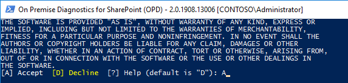
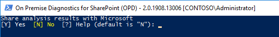
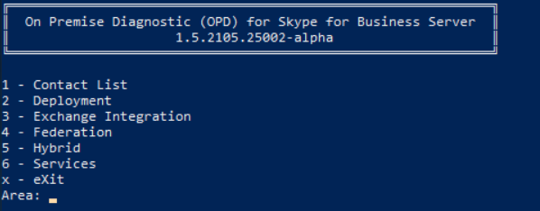

## How to use OPD in your environment

# Starting OPD for Skype for Business Server

## Command line options
OPD for Skype for Business Server has several command line options that you can select upon startup.

1. **-Mode <String>** : this indicates which mode to start OPD in. Since it is possible for
the framework to support multiple products, this provides a way to specify which mode/product
you are using. By default, the *SfBServer* mode will be selected for you.

2. **-ShareTelemetry Yes** | No : optionally share operational
telemetry data with Microsoft. The default is to **share** the telemetry data with Microsoft. You
can override here or you will be prompted later in the execution as to whether or not you want to
share data with Microsoft.

3. **-AcceptEula Yes |  No** : allows for the acceptance of the End User License Agreement (EULA)
with Microsoft. If you do not override here, you will also be prompted the first time that you run the product,
or a new version, to accept the EULA. Failure to accept the EULA will halt operation.

4. **-CheckForUpdate  Yes | No** : Specifies whether to check for a product update. By default, when OPD
starts, assuming an Internet connection, it will check to see if there is a newer version of the product available. If there is, you will
be given the option to perform an in-place upgrade to newest version.

## Invoking OPD for Skype for Business Server
By this point, you should have unzipped and copied the OPD application into its folder. Open a PowerShell (admin)
instance, and start OPD for Skype for Business Server.

1. Accept the EULA

2. Share analysis results with Microsoft?

# Areas
You will be taken to the Areas prompt. The various diagnostic scenarios are categorized by one or more areas that may be applicable.
They have been grouped in this fashion to make it easier to locate a specific diagnostic scenario.
You should see a screen similar to this:

Once you select an area, you will be presented with a list of diagnostic scenarios to choose from.

# Scenarios

In our example, we have chosen the *Federation* area. The following is a list of the diagnostic scenarios that are part of
the *Federation* area.

Select a diagnostic scenario that *most closely matches* your issue. This will cause various analyzers/rules to be invoked
to check on the status of the issue. If a rule fails, you will be provided with information to resolve the issue.

In our example we are faced with a situation where our Federation is not working in a hybrid deployment. We select option 1
to analyze the various pieces/parts that are required for successful federation. Here are the results that we get:

From this, we can see that remote user access is disabled. We are instructed on where to get further assistance on resolving this issue.
