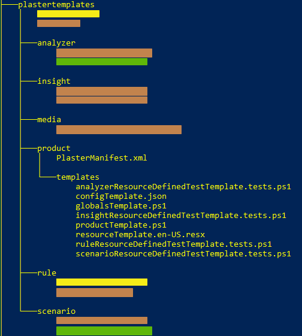
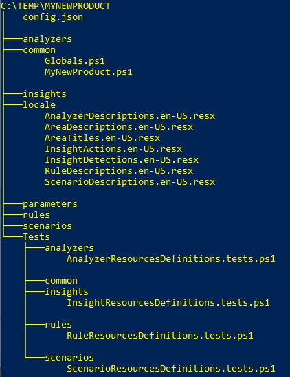
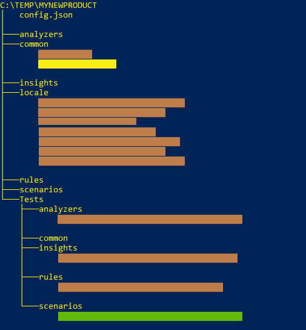
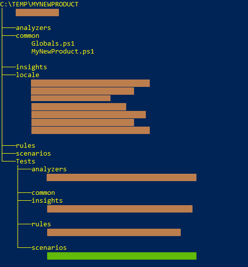
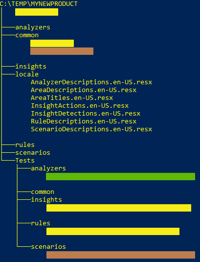
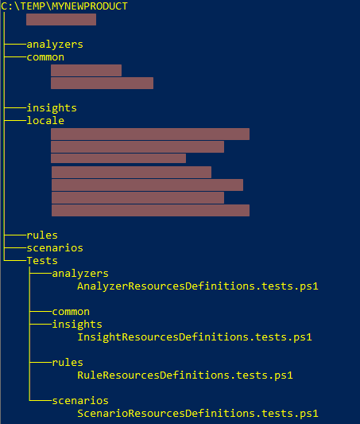

# How to use Plaster to generate your project stub

## Install Plaster
Plaster is completely open source and hosted on the PowerShell Team�s [Github](https://github.com/PowerShell/Plaster). We can grab the most
recent version from the PowerShell gallery using the below command.

```
Install-Package -Name Plaster -Source PSGallery -Verbose -Force -ForceBootstrap
````

In our source tree, you will see a **plastertemplates/product** folder



This folder contains the templates for all of the required files and folders that will need to be created
for you new product.

## Creating your project stub
If you are adding a new product to the OnPrem Diagnostic suite, you can use plaster to *jump-start* your coding.

To create a project stub using Plaster, execute the following:

```
Invoke-Plaster
           -TemplatePath <path to plastertemplates folder>\product
           -Destination <path to destination folder>
           -Name <Product Name Goes Here>
           -Description "Product Description Goes Here"
```

This will generate stub folder hierarchy for your new product

````
PS> Invoke-plaster -TemplatePath .\plastertemplates\product\ -DestinationPath c:\temp\ -Name MyNewProduct -Description "Product description"
  ____  _           _
 |  _ \| | __ _ ___| |_ ___ _ __
 | |_) | |/ _` / __| __/ _ \ '__|
 |  __/| | (_| \__ \ ||  __/ |
 |_|   |_|\__,_|___/\__\___|_|
                                            v1.1.3
==================================================
Author (Mike McIntyre):
Email (mmcintyr@microsoft.com):
Include Pester Tests?
[Y] Yes  [N] No  [?] Help (default is "Y"):
Destination path: C:\temp\
 Creating folder structure
   Create MyNewProduct\analyzers\
   Create MyNewProduct\common\
   Create MyNewProduct\insights\
   Create MyNewProduct\locale\
   Create MyNewProduct\parameters\
   Create MyNewProduct\rules\
   Create MyNewProduct\scenarios\
 Deploying common files
   Create MyNewProduct\common\Globals.ps1
   Create MyNewProduct\common\MyNewProduct.ps1
   Create MyNewProduct\locale\AnalyzerDescriptions.en-US.resx
   Create MyNewProduct\locale\AreaDescriptions.en-US.resx
   Create MyNewProduct\locale\AreaTitles.en-US.resx
   Create MyNewProduct\locale\InsightActions.en-US.resx
   Create MyNewProduct\locale\InsightDetections.en-US.resx
   Create MyNewProduct\locale\RuleDescriptions.en-US.resx
   Create MyNewProduct\locale\ScenarioDescriptions.en-US.resx
   Create MyNewProduct\config.json
 Creating Pester test folder structure
   Create MyNewProduct\Tests\
   Create MyNewProduct\Tests\analyzers\
   Create MyNewProduct\Tests\common\
   Create MyNewProduct\Tests\insights\
   Create MyNewProduct\Tests\rules\
   Create MyNewProduct\Tests\scenarios\
   Create MyNewProduct\Tests\analyzers\AnalyzerResourcesDefinitions.tests.ps1
   Create MyNewProduct\Tests\insights\InsightResourcesDefinitions.tests.ps1
   Create MyNewProduct\Tests\rules\RuleResourcesDefinitions.tests.ps1
   Create MyNewProduct\Tests\scenarios\ScenarioResourcesDefinitions.tests.ps1
````

You have just generated the minimal folder structure for your product. You will notice that during the creation
process, that you were asked if you wanted to *Include Pester Tests?* in your output. If you selected *[Y] Yes*
(the default), sample test files were generated in the *Tests* folder under your project.

Here is what the folder hierarchy looks like after generation



Let's take a closer look at the generated files and the actions required.

### config.json


The *config.json* file is used to enumerate the different areas in your product that you want to
group scenarios in. For example, if you want to group scenarios in Area1, Area2, etc., you would have
something similar to the following:

````json
{
  "areas": [
    {
      "area": "area1"
    },
    {
      "area":  "area2"
    }
  ]
}
````

### Common files



There are two (2) files that will should be included with each project. They are *Globals.ps1* and *[ProductName].ps1*.

#### Globals.ps1
This file will contain any Product specific global values. This can include things such as global variables,
enumerations, etc.

````powershell
################################################################################
# MIT License
#
# Copyright (c) 2019 Microsoft and Contributors
#
# Permission is hereby granted, free of charge, to any person obtaining a copy
# of this software and associated documentation files (the "Software"), to deal
# in the Software without restriction, including without limitation the rights
# to use, copy, modify, merge, publish, distribute, sublicense, and/or sell
# copies of the Software, and to permit persons to whom the Software is
# furnished to do so, subject to the following conditions:
#
# The above copyright notice and this permission notice shall be included in all
# copies or substantial portions of the Software.
#
# THE SOFTWARE IS PROVIDED "AS IS", WITHOUT WARRANTY OF ANY KIND, EXPRESS OR
# IMPLIED, INCLUDING BUT NOT LIMITED TO THE WARRANTIES OF MERCHANTABILITY,
# FITNESS FOR A PARTICULAR PURPOSE AND NONINFRINGEMENT. IN NO EVENT SHALL THE
# AUTHORS OR COPYRIGHT HOLDERS BE LIABLE FOR ANY CLAIM, DAMAGES OR OTHER
# LIABILITY, WHETHER IN AN ACTION OF CONTRACT, TORT OR OTHERWISE, ARISING FROM,
# OUT OF OR IN CONNECTION WITH THE SOFTWARE OR THE USE OR OTHER DEALINGS IN THE
# SOFTWARE.
#
# Filename: Globals.ps1
# Description: Global variables, enumerations, etc., that need to referenced
# across various functions.
#
# Owner: Owner Name <owneremail>
################################################################################
Set-StrictMode -Version Latest
````

#### [ProductName].ps1
This file will contain any Product specific functions.

````powershell
################################################################################
# MIT License
#
# Copyright (c) 2019 Microsoft and Contributors
#
# Permission is hereby granted, free of charge, to any person obtaining a copy
# of this software and associated documentation files (the "Software"), to deal
# in the Software without restriction, including without limitation the rights
# to use, copy, modify, merge, publish, distribute, sublicense, and/or sell
# copies of the Software, and to permit persons to whom the Software is
# furnished to do so, subject to the following conditions:
#
# The above copyright notice and this permission notice shall be included in all
# copies or substantial portions of the Software.
#
# THE SOFTWARE IS PROVIDED "AS IS", WITHOUT WARRANTY OF ANY KIND, EXPRESS OR
# IMPLIED, INCLUDING BUT NOT LIMITED TO THE WARRANTIES OF MERCHANTABILITY,
# FITNESS FOR A PARTICULAR PURPOSE AND NONINFRINGEMENT. IN NO EVENT SHALL THE
# AUTHORS OR COPYRIGHT HOLDERS BE LIABLE FOR ANY CLAIM, DAMAGES OR OTHER
# LIABILITY, WHETHER IN AN ACTION OF CONTRACT, TORT OR OTHERWISE, ARISING FROM,
# OUT OF OR IN CONNECTION WITH THE SOFTWARE OR THE USE OR OTHER DEALINGS IN THE
# SOFTWARE.
#
# Filename: MyNewProduct.ps1
# Description: Project specific functions
#
# Owner: Owner Name <owneremail>
################################################################################
Set-StrictMode -Version Latest

#
## This file contains product specific functions, types, etc
#

````

### Locale specific files



Plaster will generate the following [required] resx files for you to modify. By default,
English is the only language that is stubbed. If additional languages are required, simply
follow the same naming convention. For example, if you wanted to add French resource files,
they would be named [FileName].fr-FR.resx

| Filename | Description |
|----------|-------------|
|AnalyzerDescriptions| The description used by the analyzer |
|AreaDescriptions| The description used by the areas|
|AreaTitles|Area titles used to group scenarios|
|InsightActions|The action that is required to mitigate the failure|
|InsightDescription|The description of what was found|
|RuleDescription|The description of what the rule will look for|
|ScenarioDescription|The description of what the scenario is looking for|

### Test file stubs



Plaster will generate sample test scripts for analyzers, insights, rules, and scenarios. Each of these
stub files will validate that the required entries are in the appropriate resource files. You can use these
as a starting point to develop more specific test cases for you code.

````powershell
################################################################################
# MIT License
#
# Copyright (c) 2019 Microsoft and Contributors
#
# Permission is hereby granted, free of charge, to any person obtaining a copy
# of this software and associated documentation files (the "Software"), to deal
# in the Software without restriction, including without limitation the rights
# to use, copy, modify, merge, publish, distribute, sublicense, and/or sell
# copies of the Software, and to permit persons to whom the Software is
# furnished to do so, subject to the following conditions:
#
# The above copyright notice and this permission notice shall be included in all
# copies or substantial portions of the Software.
#
# THE SOFTWARE IS PROVIDED "AS IS", WITHOUT WARRANTY OF ANY KIND, EXPRESS OR
# IMPLIED, INCLUDING BUT NOT LIMITED TO THE WARRANTIES OF MERCHANTABILITY,
# FITNESS FOR A PARTICULAR PURPOSE AND NONINFRINGEMENT. IN NO EVENT SHALL THE
# AUTHORS OR COPYRIGHT HOLDERS BE LIABLE FOR ANY CLAIM, DAMAGES OR OTHER
# LIABILITY, WHETHER IN AN ACTION OF CONTRACT, TORT OR OTHERWISE, ARISING FROM,
# OUT OF OR IN CONNECTION WITH THE SOFTWARE OR THE USE OR OTHER DEALINGS IN THE
# SOFTWARE.
#
# Filename: AnalyzerResourcesDefined.tests.ps1
# Description: <TODO>
# Owner: Owner Name <owneremail>
#################################################################################
Set-StrictMode -Version Latest

$sut      = $MyInvocation.MyCommand.Path -replace '^(.*)\\OnPremDiagtests\\(.*?)\\(.*?)\.tests\.*ps1', '$1\src\$2\$3.ps1'
$root     = $MyInvocation.MyCommand.Path -replace '^(.*)\\OnPremDiagTests\\(.*)', '$1'
$srcRoot  = "$root\src"
$testRoot = "$root\OnPremDiagTests"
$testMode = $MyInvocation.MyCommand.Path -match "^(.*)\\OnPremDiagtests\\(.*?)\\(?<Mode>.*?)\\(.*?)\.tests\.*ps1"
$mode     = $Matches.Mode

# Load resource files needed for tests
. "$testRoot\testhelpers\LoadResourceFiles.ps1"
Import-ResourceFiles -Root $srcRoot -MyMode $mode

Describe -Tag 'MyNewProduct' "Check analyzer resources" {
    Context "Checking analyzer resources" {
        BeforeAll {
            $testCases = @()

            $insights  = Get-ChildItem $srcRoot\mode\$mode\analyzers -Recurse -Filter AD*.ps1
            $insights | ForEach-Object {$testCases += @{ClassName=$_.BaseName; FullName=$_.FullName}}
        }

        It "Analyzer <ClassName> should have a resource in AnalyzerDescriptions" -TestCases $testCases {
            param($ClassName)

            $global:AnalyzerDescriptions.GetString($ClassName) | Should Not BeNullOrEmpty
        }
    }
}

````
All of the stub files are similar in structure/content and vary by the type of files it is looking at. Also,
the variables defined at the top of the Pester script can be modified to suit your needs. By default, they are
geared towards insertion into the existing development/testing framework.
