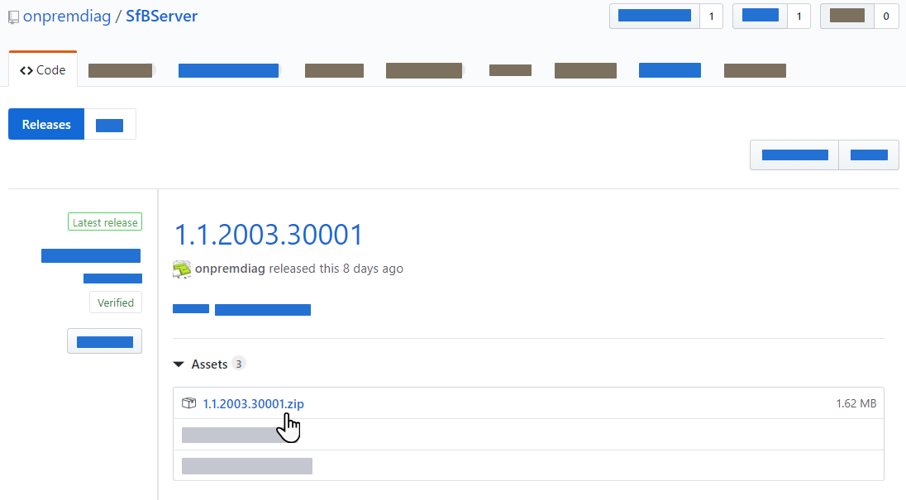
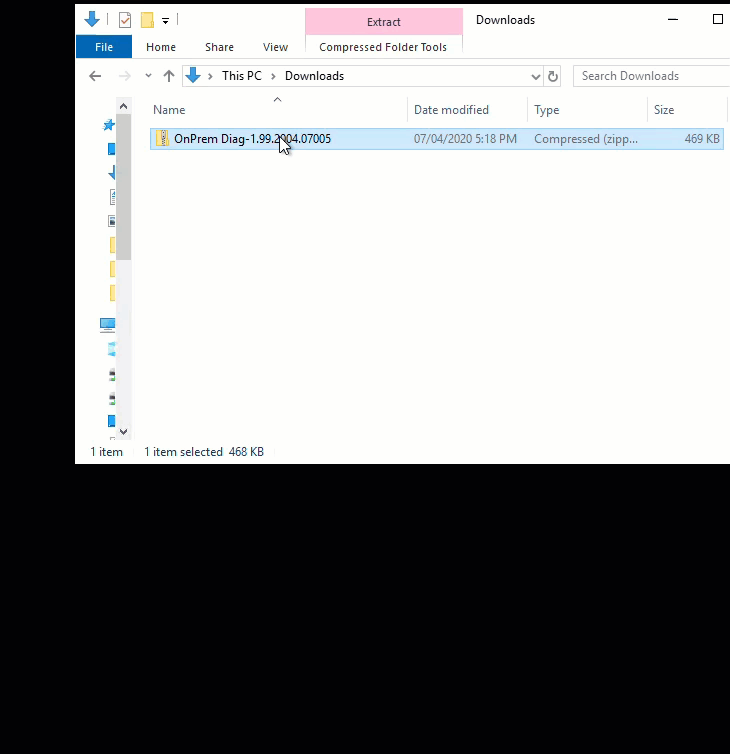

## Installing On Premise Diagnostic (OPD) for Skype for Business Server

The On Premise Diagnostic (OPD) releases are located [here.](https://github.com/onpremdiag/sfbserver/releases)

## Which version should I download?
> Which version do I download?

	- major.minor.yymm.ddrrrr

The release/version number can be interpreted as follows:

	- The first digit indicates the major release value
	- The second digit indicates the minor release value
	- The third value, yymm, indicates the year (yy) (last two
	  digits of build year) and the month (mm) that the release was built.
	- The final value, ddrrrr, indicates the day (dd) of the
	  build and the revision/build (rrr) on that day

For the following: 1.5.2106.10001, we know the following:

	- The major release is 1
	- The minor release is 5
	- It was built in the 6th month (June) of 2021 (21)
	- It was built on the 10th (1 day of the month and this was the
	  first (1) build of that day

## Installation of OPD
To download the release, simply follow these steps:

### Downloading

1. Select the release (zip file) that you want to download from GitHub

	

2. From the download location, right-click on the *properties* of the downloaded zip file
3. In the lower right-hand corner of the dialog, you will see the option to Unblock the zip file. Please check this box and click on *OK*

	

### Copying to destination

Now, you are ready to copy the contents of the file to your installation folder.

1. Open the zip file that contains the On Premise Diagnostic code in a window
2. Open another window to the destination folder that will contain OPD
3. Copy all of the files from the source folder to the destination folder

	

4. Open a PowerShell command window in the installation folder. OPD requires an administrative instance to execute the scenario properly. One of the first
checks that it will do is to determine if you are running under an administrative context. If not, it will re-start PowerShell
as an administrator (assuming you have privileges to do so).
